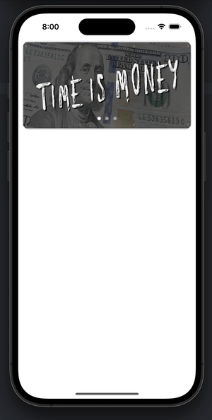

## Collection View Auto Scroll
Note that there are further settings/customization in storyboard
``` Swift
import UIKit

class ViewController: UIViewController {
    
    @IBOutlet weak var collectionView: UICollectionView!
    @IBOutlet weak var pages: UIPageControl!
    
    var imageArray = ["image1", "image2", "image3"]
    var index = 0

    
    override func viewDidLoad() {
        super.viewDidLoad()

        Timer.scheduledTimer(timeInterval: 3.0, target: self, selector: #selector(pageSetup), userInfo: nil, repeats: true)

    }
    
    @objc func pageSetup() {
          if index < imageArray.count - 1 { // index less than 2
              index = index + 1
          } else { // restart the 'loop'
              index = 0
          }
          pages.numberOfPages = imageArray.count
          pages.currentPage = index
          collectionView.scrollToItem(at: IndexPath(item: index, section: 0), at: .right, animated: true)

      }
}

extension ViewController: UICollectionViewDelegateFlowLayout, UICollectionViewDataSource {
    
    func collectionView(_ collectionView: UICollectionView, numberOfItemsInSection section: Int) -> Int {
        return imageArray.count
    }
    
    func collectionView(_ collectionView: UICollectionView, cellForItemAt indexPath: IndexPath) -> UICollectionViewCell {
        guard let cell = collectionView.dequeueReusableCell(withReuseIdentifier: "imageCell", for: indexPath) as? CustomCollectionViewCell else {
            fatalError("could not dequeue a CustomCollectionViewCell")
        }
        cell.photoImage.image = UIImage(named: imageArray[indexPath.row])
        cell.layer.borderWidth = 1
        cell.layer.borderColor = UIColor.white.cgColor
        cell.layer.cornerRadius = 20
        return cell
    }
    
    func collectionView(_ collectionView: UICollectionView, layout collectionViewLayout: UICollectionViewLayout, sizeForItemAt indexPath: IndexPath) -> CGSize {
        return CGSize(width: collectionView.frame.width, height: collectionView.frame.height)
    }
    
}
```

### Gif

