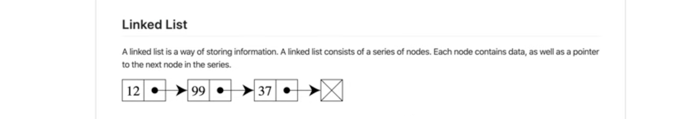

# Linked List 

``` Swift
import UIKit

// abstract data structures (i.e a "Stack") are not intrinsic to swift. Abstract data structures are created with an intended purpose

// a linked list is a data structure that could be compared to a train. If you want to add or remove something to/from the train/list, you connect/remove the "car" to/from the train at the end

// the cars of the train are called "nodes" and the people 'inside' are the values

// node.next "next pointer" refers to the node being connected to another car or train.
// if the node is not connected to anything, the the pointer/connection of that node is pointing to nil

// Review, Any is not type safe. Generics promote type safety by enforcing the same type

// ================================================================
// *** Node: An individual part of a larger data structure ***
// ================================================================

// Abstract Node Data structure
class Node<T: Equatable>: Equatable {
    // This class is a singly linked list, meaning you can only see the next pointer - go forward
    var value: T
    var next: Node? // the next pointer
    init(_ value: T) {
        self.value = value
    }
    static func ==(lhs: Node<T>, rhs: Node<T>) -> Bool {
        return lhs.value == rhs.value && lhs.next == rhs.next
    }
}

extension Node: CustomStringConvertible { // giving Node a description to use when printing
    var description: String {
        guard let next = next else {
            // if the node is not connected, print...
            return "\(value) -> nil" // 12 -> nil
        }
        // if the node is connected, print...
        return "\(value) -> \(next)" // 12 -> 99
    }
}

// instantiating node instances
let car12 = Node<Int>(12)
let car99 = Node<Int>(99)

// link the nodes (linked list using connected nodes)
car12.next = car99

// print the current state of the linked node
// to print nodes in a readable manner, CustomStringConvertible is needed to give the Node class Type a description

print(car12.description)

// implementation of linked list
class LinkedList<T: Equatable> {
    var head: Node<T>? // both properties are nil cause they may not exist
    var tail: Node<T>?
    
    // first computed property
    public var first: Node<T>? {
        return head
    }
    
    // last computed property
    public var last: Node<T>? {
        return tail
    }
    
    // isEmpty computed property
    public var isEmpty: Bool {
        print("empty list")
        return head == nil // if head is equal to nil then the list is empty
    }
    

    // append method - adds a node to the end of the list
    public func append(_ value: T) {
        // create a Node
        let newNode = Node(value)
        
        // scenario 1: appending to an empty list
        guard let lastNode = tail else { // meaning there is a tail
            // in the else block, the linked list is empty
            head = newNode
            tail = head
            return
        }
        // scenario 2: existing nodes
        lastNode.next = newNode
        tail = newNode
    }
    
    // removeLast method - removes the last node from the end of the list
    public func removeLast() -> Node<T>? {
        // scenario 1: empty list
        if isEmpty {
            return nil
        }
        var removedNode: Node<T>?
        // scenario 2: head and tail are pointing to the same Node
        if head == tail {
            removedNode = head
            head = nil
            tail = nil
            return removedNode
        }
        // scenario 3: Multiple Nodes - iterate, walk, traverse the linked list from the head
        var currentNode = head
        
        while currentNode?.next != tail { // stop at Node before the tail
            // keep traversing
            currentNode = currentNode?.next // increment currentNode by 1
        }
        
        // where is current Node at the end of the while loop? 2nd to last
        
        // save the tail's node before removing the las node (tail)
        removedNode = tail
        
        // set tail to Node before the last node
        tail = currentNode
        
        currentNode?.next = nil
        
        return removedNode
    }
}

extension LinkedList: CustomStringConvertible {
    // extensions can not have stored properties. Only computed properties
    var description: String {
        guard let head = head else {
            return "empty list"
        }
        return "\(head)"
    }
}


let members = LinkedList<String>()
members.append("Steve")
members.append("Dave")
members.append("Sarah")
members.append("Tom")
members.append("Jen")

print(members) // Oscar -> Nil

// test removing last node

members.removeLast()
print(members)
members.removeLast()
members.removeLast()
members.removeLast()
members.removeLast()
print(members)

```


