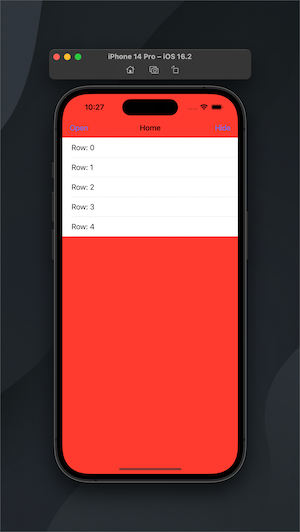
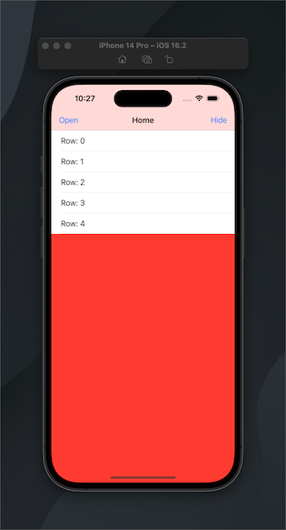

## Navigation Bar Appearance  
iOS 13 brought with it a lot of changes with one being the appearance of the nav bar. Pre iOS 13, the nav bar was translucent. Post iOS 13, the nav bar is transparent. Attached are two images showcasing the differences.

Transparent  |  Translucent 
--- | ---
 | 


If you want the old style, go into the app delegate and add this code to the didFinishLaunchingWithOptions medthod 

```Swift
    func application(_ application: UIApplication, didFinishLaunchingWithOptions launchOptions: [UIApplication.LaunchOptionsKey: Any]?) -> Bool {
        // this code is needed in order to go back to a translucent background instead of transparent
        
        let appearance = UINavigationBarAppearance()
        appearance.configureWithDefaultBackground()
        UINavigationBar.appearance().scrollEdgeAppearance = appearance
        return true
    }
 ```

